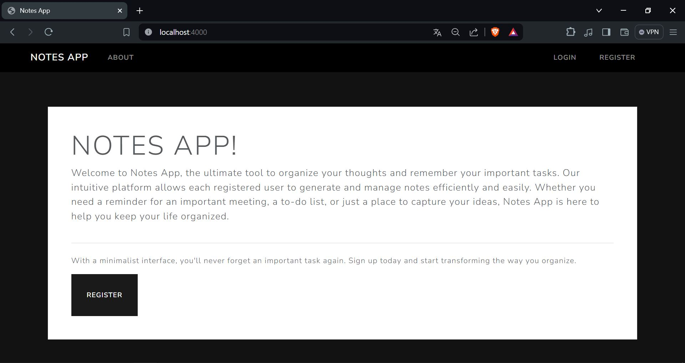
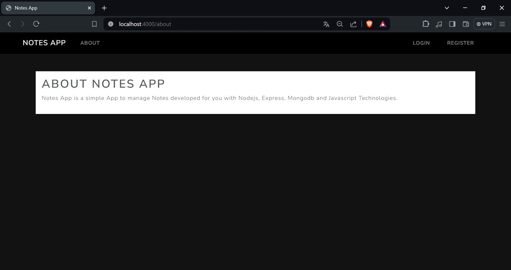
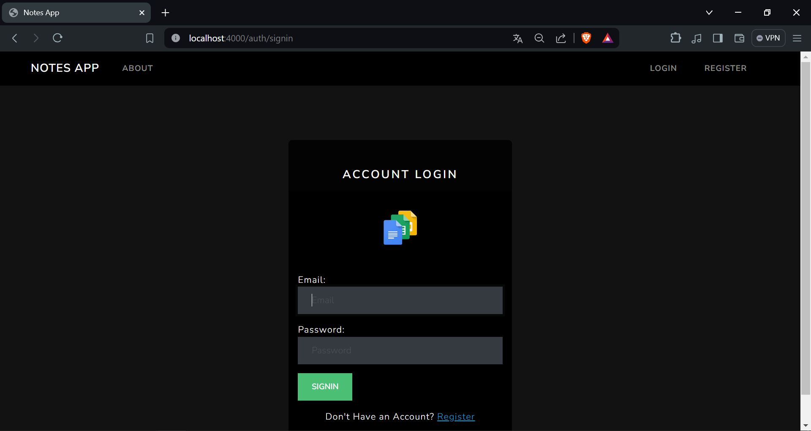
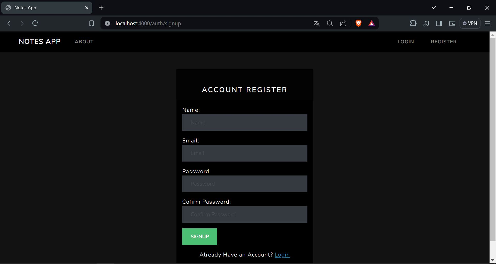
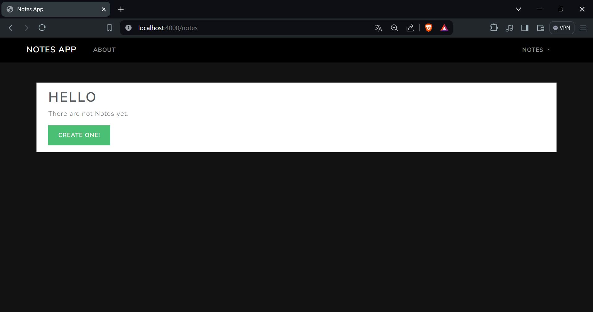
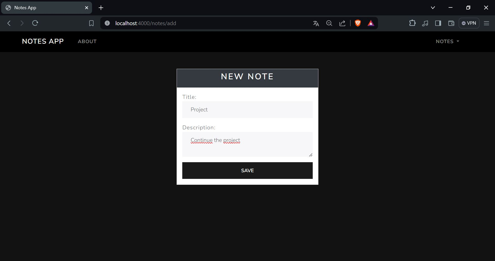
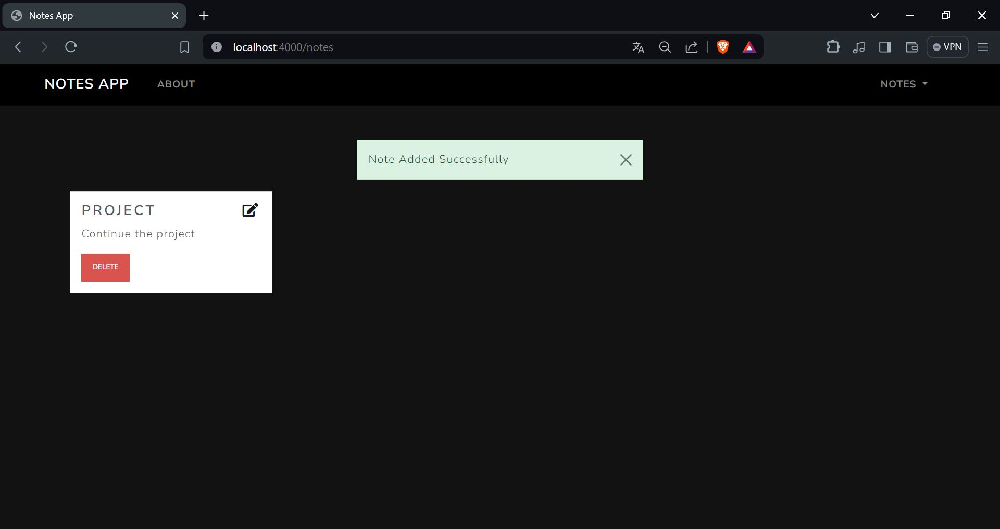
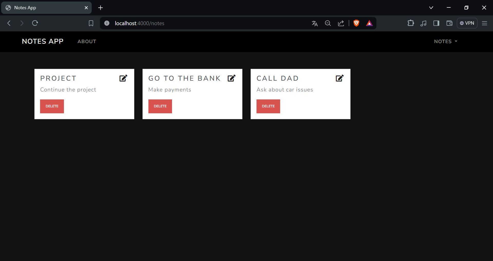
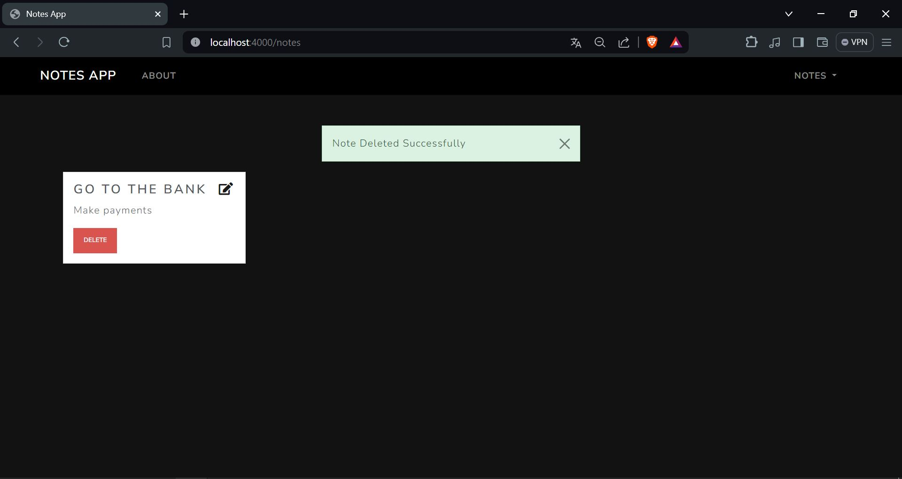
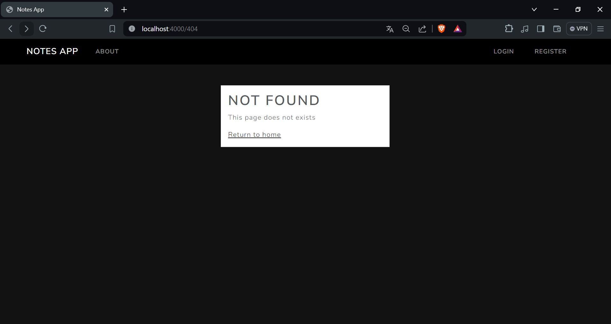

# Notes App 

Esta es una aplicación web básica para administrar notas simples en la web utilizando tecnologías Javascript como Nodejs, Mongodb y otras tecnologías relacionadas. A continuacion se mostrara una breve guia de instalacion y una vista general de la aplicacion en la cual puedes realizar las siguientes acciones:

### - Visitar la pagina de inicio y conocer mas acerca de la pagina.






### - Iniciar sesion o registrarte si aun no lo has hecho.






### - Esta es la pagina de inicio al haber ingresado



### - Aqui podras crear nuevas notas de tus tareas importantes.



### - Una vez has comenzado a añadir tus notas se te mostraran todas y cada una de ellas. 






### - Si has completado alguna de tus tareas o ya no las necesitas mas puedes eliminarlas.



### - Por ultimo tambien hay un apartado al cual se te puede redireccionar si has accedido a una ruta incorrecta.




### Instalacion

```sh
git clone https://github.com/Dhris7/Proyecto-Computacion-Tolerante-a-Fallas
cd nodejs-notes-app
npm i
npm run dev # run in development mode
npm start # run in production mode
```

> Es recomendable tener Mongodb instalado localmente o establecer una variable de entorno MONGODB_URI para poder conectarse a cualquier instancia de mongodb.

### Variables del entorno

Esta applicacion podria requerir ajustar las siguientes variables para una correcta ejecucion.

- `MONGODB_URI` Mongodb URI variable tipo string para asignar la ruta de la base de datos.
- `PORT` Puerto http del servidor para la aplicación.
- `NODE_ENV` Entorno de node.

### Docker-compose
 
La forma mas sencilla de instalar el proyecto es usando docker-compose:

```shell
git clone https://github.com/Dhris7/Proyecto-Computacion-Tolerante-a-Fallas
cd nodejs-notes-app
docker-compose up
```

### Usuario por defecto

Cuando se inicie la aplicación, se creará un usuario administrador por defecto con las siguientes credenciales:

- email: `admin@localhost`
- password: `adminpassword`

